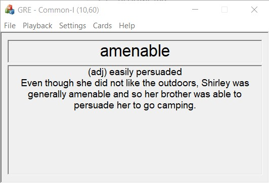

# FlashcardPlayer

## This is a Flashcard Player MFC Application for GRE Vocabulary

### Description

While I was studying GRE vocabulary, I didn't have time to dedicate a separate time for memorizing them so I made a flashcard player that would show each word and reveal its meaning after a couple of seconds. It would also play the pronunciation and you could set the card playback speed. This program could be useful if you spend a lot of time in front of the computer and you don't mind occasionally learning a new word.

I used Visual Studio, C++ language and MFC Windows Application for this project.

In order for the app to stay responsive while the audio was playing, I used a thread to handle the playback.

##### Here is how the app looks:

</img>

### Features

Here are some of the features

- App **always on top** option
- Playing pronunciation audio
- Shuffle playing cards
- Changing flashcard front and back playback speed

## How to use

Download the content of [App](App) and you are all set.

### Audio

You can add your own audio files and place the Audio folder next to the GRE.exe file.

#### Directory Format

```
App/
  Audio/
    aberrant.mp3
  Database/
  GRE.exe
```
